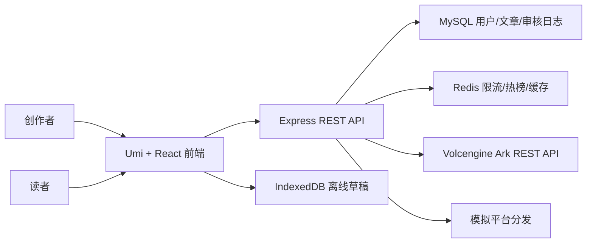

# 系统架构设计

## 设计目标

平台目标是把创作者从灵感输入、AI 生成、内容审核、质量评分、草稿恢复、发布、分发到内容消费的链路串起来。系统优先保证三件事：

- 创作不中断：在线自动保存，断网后继续写作，恢复网络后同步。
- 发布有门槛：发布前进行安全审核和质量评分，风险内容自动驳回。
- 消费可排序：热榜综合质量分、阅读热度和时间衰减，让优质内容获得更高曝光。

## 架构概览



## 前端模块

| 模块 | 文件 | 职责 |
|---|---|---|
| 登录注册 | `src/pages/login` | 账号登录、注册、错误反馈 |
| 认证模型 | `src/models/auth.ts` | 本地 token 持久化、状态管理、退出 |
| 创作工作台 | `src/pages/creator` | Prompt、素材、AI 生成、审核、草稿、发布 |
| 离线草稿 | `src/utils/offlineDraft.ts` | localForage 队列、脏草稿扫描、同步标记 |
| 爆文发现 | `src/pages/index` | 无限滚动、骨架屏、热榜内容消费入口 |
| 文章详情 | `src/pages/article` | 详情阅读、元数据、二次编辑入口 |
| API 封装 | `src/services/api.ts` | 统一 token、query、错误处理 |

## 后端模块

| 模块 | 文件 | 职责 |
|---|---|---|
| 应用入口 | `ai-creator-backend/src/app.js` | Express 初始化、路由、限流、错误处理 |
| 用户认证 | `controllers/auth.controller.js` | 登录、注册、JWT 签发 |
| 文章管理 | `controllers/article.controller.js` | 草稿保存、离线同步、发布、详情 |
| AI 能力 | `services/ai.service.js` | 火山方舟 REST 接入、文本生成、图片生成、视频生成、审核、评分、兜底 |
| 热榜排序 | `services/ranking.service.js` | 热度公式、Redis zset、DB fallback |
| 模拟分发 | `services/distribution.service.js` | 生成头条/抖音模拟分发 ID |

## 数据模型

| 表 | 核心字段 | 说明 |
|---|---|---|
| `users` | `username`、`phone`、`email`、`password_hash` | 用户账号 |
| `articles` | `user_id`、`title`、`content`、`media_urls`、`status`、`quality_score`、`view_count`、`like_count`、`favorite_count`、`negative_count` | 草稿和已发布内容 |
| `audit_logs` | `article_id`、`risk_category`、`is_compliant`、`raw_ai_response` | 审核结果留痕 |
| `prompt_templates` | `user_id`、`name`、`category`、`content`、`usage_count` | 系统默认和用户自定义 Prompt |
| `materials` | `user_id`、`name`、`url`、`media_type`、`risk_status`、`risk_reason` | 用户素材库 |
| `article_versions` | `article_id`、`version_no`、`title`、`content`、`media_urls`、`source` | 保存、发布、同步、撤回和回滚记录 |

## 关键链路

### 登录

1. 前端提交账号和密码。
2. 后端按用户名、手机号或邮箱查找用户。
3. bcrypt 校验密码，通过后签发 7 天 JWT。
4. 前端持久化用户信息，更新认证模型并跳转工作台。

### 创作和发布

1. 用户输入 prompt 或选择模板。
2. 前端调用 `/api/v1/ai/generate` 生成标题和正文。
3. 用户可调用 `/api/v1/ai/generate-image` 通过 Doubao-Seedream 生成封面图，也可调用 `/api/v1/ai/generate-video` 生成视频素材。
4. 在线时每 30 秒保存草稿；离线时写入 IndexedDB。
5. 发布时后端先审核，再评分。
6. 审核不通过则状态为 `rejected` 并返回替代文本；通过则状态为 `published` 并刷新热榜。

### AI 接入

后端统一在 `ai-creator-backend/src/services/ai.service.js` 封装火山方舟 REST API：

| 能力 | 环境变量 | REST 接口 |
|---|---|---|
| 文本生成、审核、评分 | `ARK_TEXT_MODEL` | `/api/v3/responses` |
| 图片生成 | `ARK_IMAGE_MODEL` + `ARK_IMAGE_API=images` | `/api/v3/images/generations` |
| 视频生成 | `ARK_VIDEO_MODEL` + `ARK_VIDEO_API=responses` | `/api/v3/responses` |

图片模型当前按 Doubao-Seedream-4.0 示例接入，使用 `ARK_IMAGE_MODEL=doubao-seedream-4-0-250828` 和 `ARK_IMAGE_API=images`。模型密钥只保存在后端 `.env`，前端不直接接触第三方 API Key。

### 离线恢复

1. 离线状态下，编辑内容写入 localForage，标记 `dirty=true`。
2. 网络恢复后，前端提交脏草稿列表。
3. 后端按草稿 `id` 更新已有文章，没有服务端 ID 时创建新草稿。
4. 后端返回 `localId -> serverId` 映射，前端清除 dirty 标记，避免重复创建。

### 热榜排序

热榜分数由质量、阅读和时间衰减组成：

```text
score = quality_score * 0.4 + ln(view_count + 1) * 0.4 + ln(like_count + favorite_count * 2 + 1) * 0.3 - negative_count * 0.3 - age_hours * 0.2
```

Redis zset 是主路径，MySQL 按质量分降序是 Redis 不可用或未命中的 fallback。

## 可用性设计

- AI 密钥缺失或外部模型不可用时返回本地兜底内容，保证演示链路不中断。
- Redis 限流失败时降级放行，不阻断核心业务。
- 热榜 Redis 为空时从 MySQL 查询已发布内容。
- 前端使用 ErrorBoundary 防止单页渲染错误扩散。
- 离线草稿优先存本地，避免网络波动导致内容丢失。

## 性能设计

- Umi granularChunks 拆分构建产物。
- 信息流图片对首屏前三张使用 eager/high priority，后续 lazy loading。
- 无限滚动使用 IntersectionObserver。
- 前端采集 LCP 并输出到 console，便于本地和线上验证。
- 热榜数据使用 Redis zset，文章详情缓存 10 分钟。

## 当前边界

- Prompt 管理已支持默认模板和用户模板 CRUD，团队共享和模板版本主要保留在后端 API。
- 素材管理已支持 URL 素材库、基础风险词/类型校验和上传凭证流程，生产环境需配置 OSS。
- 分发为模拟实现，没有接入真实头条/抖音 Open API。
- 审核准确率需要用人工标注数据集持续评估。
